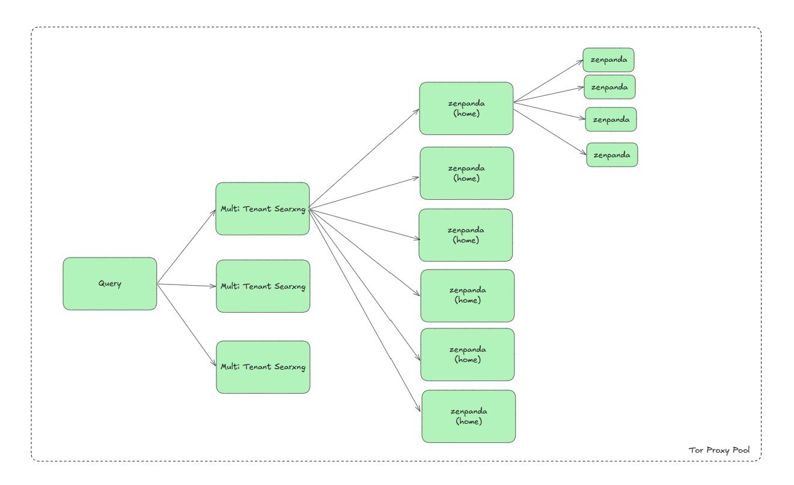

# SingleLeaf

A Go-based search aggregation service that routes queries through a rotating Tor proxy pool to SearXNG, returning deduplicated JSON results from multiple search engines across multiple anonymized connections. Top results can be deep-rendered via ZenPanda for full page text extraction.



## Architecture

```
                                                          ┌──────────────┐
                                                     ┌───>│ Search Engine│
                                                     │    └──────────────┘
Client ──> SingleLeaf (:8081) ──[5x fan-out]──> SearXNG (:8080) ──[Tor Proxy :3128]──> Search Engines
                │                                                    │
                │                                                    ▼
                │                                              100 Tor circuits
                │                                             (rotating exit IPs)
                │
                └──[top N results]──> ZenPanda (:9222) ──> Render pages via CDP
```

**Search flow:** Each query triggers 5 parallel requests to SearXNG. Each is routed through a different Tor exit IP via the proxy pool's round-robin mechanism. Results are merged, deduplicated by URL, and ranked by accumulated score.

**Deep search flow:** After merging, the top N results are rendered in parallel through ZenPanda (a headless browser) using the Chrome DevTools Protocol. The rendered page text is returned alongside the search metadata.

## Stack

| Service | Image | Port | Role |
|---|---|---|---|
| **single-leaf** | `ronxldwilson/single-leaf` | 8081 | Query fan-out, deduplication, deep rendering, API |
| **zenpanda** | `ronxldwilson/zenpanda` | 9222 | Headless browser for page rendering (CDP) |
| **searxng** | `ronxldwilson/searxng-slim` | 8080 | Metasearch engine (40+ engines, JSON API) |
| **tor-proxy** | `ronxldwilson/tor-proxy-pool` | 3128, 4444 | 100 rotating Tor circuits |

## How It Works

1. **Client** sends `GET /search?q=your+query` to SingleLeaf
2. **SingleLeaf** fires 5 parallel requests to SearXNG (configurable via `SINGLE_LEAF_FANOUT`)
3. **SearXNG** fans out to 40+ search engines (Google, Brave, DuckDuckGo, Bing, Mojeek, StackOverflow, Wikipedia, and many more)
4. Each outbound request from SearXNG is routed through the **Tor proxy pool**, which round-robins across 100 virtual Tor circuits via SOCKS5 auth isolation — every request exits from a different IP
5. **SingleLeaf** collects all 5 responses, deduplicates results by normalized URL, accumulates scores, merges engine lists, and returns a single JSON response sorted by relevance

For deep search, an additional step renders the top N result pages through ZenPanda to extract their full text content.

## Deduplication

- URLs are normalized (lowercase, strip `www.`, trailing `/`, protocol) before comparison
- Duplicate results have their scores summed and engine lists merged
- The longer content snippet is kept
- Answers, suggestions, and infoboxes are also deduplicated

## API

### `GET /search`

| Parameter | Required | Description |
|---|---|---|
| `q` | Yes | Search query |
| `categories` | No | Engine categories (e.g., `general`, `it`, `images`) |
| `lang` | No | Language code (e.g., `en`, `fr`) |
| `pageno` | No | Page number for pagination |

### `GET /deep-search`

| Parameter | Required | Description |
|---|---|---|
| `q` | Yes | Search query |
| `render` | No | Number of top results to render (default: `DEEP_RENDER_COUNT`) |
| `categories` | No | Engine categories |
| `lang` | No | Language code |
| `pageno` | No | Page number |

Returns search results plus `page_text` (rendered page content) and `render_time_ms` for each rendered result.

### `GET /health`

Returns `{"status": "ok"}`.

## Configuration

| Environment Variable | Default | Description |
|---|---|---|
| `SINGLE_LEAF_PORT` | `8081` | Listen port |
| `SEARXNG_URL` | `http://searxng:8080` | SearXNG instance URL |
| `ZENPANDA_URL` | `http://zenpanda:9222` | ZenPanda headless browser URL |
| `SINGLE_LEAF_FANOUT` | `5` | Number of parallel requests per query |
| `DEEP_RENDER_COUNT` | `5` | Number of top results to deep-render |
| `DEEP_WAIT_MS` | `3000` | Wait time (ms) for page rendering |
| `TOR_INSTANCES` | `100` | Number of Tor circuits in the proxy pool |
| `TOR_REBUILD_INTERVAL` | `1800` | Tor circuit rebuild interval (seconds) |

## SearXNG Configuration

The mounted `searxng/settings.yml` includes:

- **40+ search engines enabled** across general, IT, news, images, videos, science, and package categories
- **JSON format enabled** alongside HTML
- **Outbound proxy** set to `http://tor-proxy:3128` so all search engine requests go through Tor
- **Engine auto-suspension disabled** — all `suspended_times` set to 0, since each request comes from a fresh Tor exit IP
- **15-second request timeout** to accommodate Tor latency

## Logging

SingleLeaf outputs structured JSON logs via Go's `slog` package:

```json
{"time":"...","level":"INFO","msg":"search completed","query":"golang","fanout_ok":5,"fanout_total":5,"results":94,"elapsed_ms":1234}
{"time":"...","level":"INFO","msg":"deep-search completed","query":"golang","search_results":94,"rendered_ok":3,"rendered_total":3,"elapsed_ms":5678}
```

## Quick Start

```bash
docker compose up --build -d
```

Search:

```bash
curl "http://localhost:8081/search?q=hello+world"
```

Deep search (renders top 3 result pages):

```bash
curl "http://localhost:8081/deep-search?q=hello+world&render=3"
```

Check Tor proxy stats:

```bash
curl "http://localhost:4444"
```

## Verify IP Rotation

```bash
# Each request should show a different exit IP
for i in $(seq 1 5); do curl -sx localhost:3128 https://httpbin.org/ip; echo; done
```

## Testing

```bash
go test -v ./...
```

Unit tests cover URL normalization, score-based sorting, result deduplication and merging, engine list merging, and answer/suggestion/infobox deduplication.
